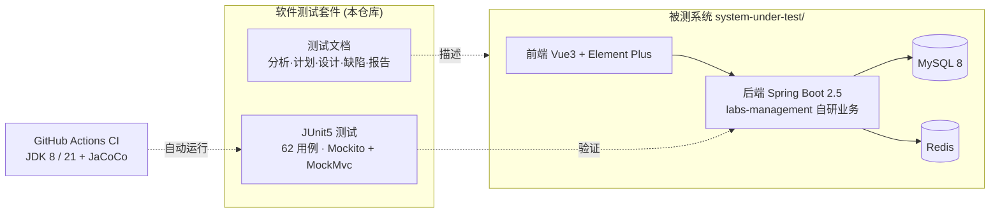

# 开放实验室预约系统 · 软件测试套件

> Open Lab Reservation System — Software Test Suite

[](https://github.com/LeiQingliang/open-lab-reservation-system-test-suite/actions/workflows/ci.yml)

-74%25-green.svg)


本仓库是 **「开放实验室网上预约管理系统」** 的完整软件测试工程交付物，涵盖从需求分析、测试计划、用例设计、单元/接口/性能测试实现，到缺陷跟踪与测试报告的**软件测试全生命周期**文档；并内附被测系统源码，便于一键复现测试环境。核心自动化测试在 **GitHub Actions（JDK 8 / 21）上持续运行**。

---

## 📋 目录

- [✨ 项目简介](#-项目简介)
- [🧱 架构总览](#-架构总览)
- [📁 目录结构](#-目录结构)
- [🧪 运行测试](#-运行测试)
- [🧭 文档导航](#-文档导航)
- [🔬 被测系统](#-被测系统)
- [🤝 参与贡献](#-参与贡献)
- [📜 许可证](#-许可证)

---

## ✨ 项目简介

这是一个 **软件测试套件**（而非一款产品）：以「开放实验室网上预约管理系统」为被测对象，系统性地完成并交付一整套测试工程产物。

亮点：

- 🧪 **62 个可自动运行的测试**：基于 JUnit 5 + Mockito + MockMvc（standaloneSetup），覆盖实验室 CRUD、排期笛卡尔积发布、预约冲突检测、审核流转等核心业务；纯单元/接口测试，**无需数据库/Redis** 即可离线运行。
- 🤖 **真正的持续集成**：每次提交都会在 **JDK 8 与 21** 双版本矩阵上自动构建并运行全部测试，并产出 **JaCoCo 覆盖率**（labs-management 自研业务模块：行 74%、分支 85%）。
- 📚 **全生命周期文档**：`docs/` 按 `01-analysis → 06-reports` 组织，含分析、计划、用例设计、白盒路径、缺陷清单与测试报告，并附正式 `.docx` 交付物与答辩大纲。
- 🚀 **一键复现环境**：内附被测系统源码（RuoYi 前后端分离），一条命令用 Docker 拉起 MySQL + Redis + 前后端。

---

## 🧱 架构总览



---

## 📁 目录结构

```text
open-lab-reservation-system-test-suite/
├── .github/                     协作与自动化配置
│   ├── workflows/ci.yml         CI：JDK 8/21 运行测试 + JaCoCo 覆盖率
│   ├── ISSUE_TEMPLATE/          Issue 模板（Bug / 功能建议）
│   ├── PULL_REQUEST_TEMPLATE.md PR 模板
│   ├── CODEOWNERS               代码负责人
│   └── dependabot.yml           依赖更新
├── docs/                        测试工程文档（按软件测试生命周期组织）
│   ├── 01-analysis/             系统与需求分析
│   ├── 02-test-plan/            测试需求与测试计划
│   ├── 03-test-design/          测试设计（用例 / 白盒路径）
│   ├── 04-test-implementation/  测试实现（单元测试代码 / 性能脚本）
│   ├── 05-defects/              缺陷分析与缺陷清单
│   ├── 06-reports/              测试结果汇总
│   ├── diagrams/                图表源码（Mermaid）
│   ├── guides/                  操作指南
│   ├── reference/               参考资料
│   └── deliverables/            正式交付物（Word 文档 + 答辩大纲）
├── system-under-test/           被测系统源码（RuoYi 前后端分离）
│   ├── back/labs/               Spring Boot 后端（Maven 多模块，内置 mvnw）
│   │   └── labs-management/src/test/   ⭐ 自动化测试代码（本套件核心）
│   ├── front/RuoYi-Vue3/        Vue 3 前端
│   ├── docker-compose.yml       一键启动编排
│   └── .env.example             环境变量模板（复制为 .env）
├── start.* / stop.*             一键启动 / 停止脚本（Win / *nix）
├── CONTRIBUTING.md              贡献指南
├── SECURITY.md                  安全策略
├── CHANGELOG.md                 更新日志
├── CITATION.cff                 引用元数据
└── LICENSE                      MIT 许可证
```

---

## 🧪 运行测试

测试为纯 **JUnit 5 + Mockito + MockMvc**，不依赖数据库/Redis/Spring 上下文，可离线运行。后端工程位于 `system-under-test/back/labs`（其上方无聚合 pom）：

```bash
cd system-under-test/back/labs

# 使用内置 Maven Wrapper（无需本机预装 Maven）
./mvnw -B -pl labs-management -am clean test          # Linux / macOS
.\mvnw.cmd -B -pl labs-management -am clean test       # Windows PowerShell
```

- `-am`（**务必保留**）：一并编译上游模块（`labs-framework`/`labs-system`/`labs-common`），否则 `SysPostServiceImplTest` 编译失败。
- 覆盖率报告：测试结束后见 `labs-management/target/site/jacoco/index.html`。

### 当前测试基线

| 指标 | 数值 |
|------|------|
| 测试类 | 7 |
| 测试方法（`@Test`） | **62**（全部通过） |
| 行覆盖率（labs-management） | 74.4% |
| 分支覆盖率（labs-management） | 84.6% |
| 验证环境 | JDK 8、JDK 21（CI 矩阵） |

> ⚙️ 上述覆盖率为**自研业务模块 labs-management** 的 JaCoCo 统计（不含 vendored RuoYi 框架代码）。完整的手工测试战役（功能/输入校验/业务规则/接口/白盒/性能/安全等）见 [`docs/06-reports/`](docs/06-reports/)。

---

## 🧭 文档导航

测试过程按生命周期阶段组织，`docs/` 下子目录前缀编号即为推荐阅读顺序。

| 阶段 | 文档 | 说明 |
|------|------|------|
| ① 分析 | [01_系统上下文分析.md](docs/01-analysis/01_系统上下文分析.md) | 系统上下文与边界分析 |
| ① 分析 | [02_功能模块与数据库分析.md](docs/01-analysis/02_功能模块与数据库分析.md) | 功能模块划分与数据库结构分析 |
| ① 分析 | [项目全面分析.md](docs/01-analysis/项目全面分析.md) | 项目整体分析概览 |
| ② 计划 | [03_测试需求与测试计划.md](docs/02-test-plan/03_测试需求与测试计划.md) | 测试需求梳理与总体测试计划 |
| ③ 设计 | [04_测试用例设计.md](docs/03-test-design/04_测试用例设计.md) | 测试用例设计 |
| ③ 设计 | [测试用例总表.md](docs/03-test-design/测试用例总表.md) | 全量测试用例汇总表 |
| ③ 设计 | [06_白盒路径分析.md](docs/03-test-design/06_白盒路径分析.md) | 白盒测试路径分析 |
| ③ 设计 | [书写测试用例举例.md](docs/03-test-design/书写测试用例举例.md) | 测试用例书写示例 |
| ④ 实现 | [05_单元测试代码.md](docs/04-test-implementation/05_单元测试代码.md) | 单元测试代码说明 |
| ④ 实现 | [08_性能测试脚本.md](docs/04-test-implementation/08_性能测试脚本.md) | 性能测试脚本 |
| ⑤ 缺陷 | [07_缺陷分析与修复.md](docs/05-defects/07_缺陷分析与修复.md) | 缺陷分析与修复记录 |
| ⑤ 缺陷 | [T29_缺陷清单.md](docs/05-defects/T29_缺陷清单.md) | 缺陷清单 |
| ⑥ 报告 | [09_测试结果汇总.md](docs/06-reports/09_测试结果汇总.md) | 测试结果汇总 |
| 图表 | [T29_图表源码_mermaid.md](docs/diagrams/T29_图表源码_mermaid.md) | 报告所用图表的 Mermaid 源码 |
| 指南 | [如何启动项目.md](docs/guides/如何启动项目.md) | 被测系统完整启动与开发指南 |
| 参考 | [单元测试共通点检查表](docs/reference/管理信息系统单元测试共通点检查表_图片内容提取.txt) | 单元测试共通点检查表(图片提取) |

### 📦 正式交付物（`docs/deliverables/`）

| 交付物 | 文件 |
|--------|------|
| 测试计划 | `T29_测试计划.docx` |
| 测试设计 | `T29_测试设计.docx` |
| 测试报告 | `T29_测试报告.docx` |
| 测试跟踪日志 | `T29_测试跟踪日志.docx` |
| 课程设计说明书 | `T29_课程设计说明书.docx` |
| 答辩大纲 | [T29_答辩大纲.md](docs/deliverables/T29_答辩大纲.md) |

---

## 🔬 被测系统

被测系统是基于 **若依(RuoYi)v3.8.9** 前后端分离框架二次开发的「开放实验室网上预约管理系统」，源码完整存放于 [`system-under-test/`](system-under-test/)，便于复现测试环境。自写业务集中在后端 `labs-management` 模块（实验室浏览、排课发布、预约）及对应前端视图。

### 🚀 一键启动（推荐）

只需安装 **Docker Desktop**，在仓库根目录运行 `start.bat` / `./start.ps1`（Windows）或 `./start.sh`（Linux/macOS），即可自动构建并拉起 MySQL + Redis + 后端 + 前端四个容器，无需本机安装 JDK/Maven/Node/MySQL/Redis。

启动后访问 **http://localhost:81** ，使用 `admin / admin123` 登录。停止用 `stop.bat` / `./stop.sh`。

> 🔐 **安全提示**：`admin/admin123`、数据库 `root` 等均为本地演示默认口令，**切勿用于公网或生产环境**。可通过复制 `system-under-test/.env.example` 为 `.env` 覆盖端口与口令。

#### 端口对照（默认值，可经 `.env` 覆盖）

| 服务 | 宿主机端口 | `.env` 变量 |
|------|-----------|-------------|
| 前端 | 81 | `FRONTEND_HOST_PORT` |
| 后端 | 8080 | `BACKEND_HOST_PORT` |
| MySQL | 3307 | `MYSQL_HOST_PORT` |
| Redis | 6380 | `REDIS_HOST_PORT` |

完整环境搭建与启动步骤（含 Docker 一键启动与传统手动方式）见 **[如何启动项目.md](docs/guides/如何启动项目.md)**。

### 技术栈

| 层级 | 技术 | 版本 |
|------|------|------|
| 后端 | Spring Boot + MyBatis + Maven | 2.5.15 |
| 前端 | Vue 3 + Element Plus + Vite | 3.4 / 2.4 / 5.0 |
| 数据库 | MySQL | 8.0（兼容 5.7） |
| 缓存 | Redis | 6.x+ |
| 安全 | Spring Security + JWT | 5.7 / jjwt 0.9 |
| 连接池 | Druid | 1.2.23 |
| JDK | Temurin / OpenJDK | **8**（编译目标，Docker 镜像内置）；测试在 8 与 21 均验证 · **不支持 JDK 25+** |

> 数据库初始化脚本位于 `system-under-test/back/labs/sql/`。

---

## 🤝 参与贡献

欢迎补充测试用例、完善文档或改进工程化。请先阅读：

- [贡献指南 CONTRIBUTING.md](CONTRIBUTING.md) — 开发环境、运行测试、提交与 PR 规范
- [行为准则 CODE_OF_CONDUCT.md](CODE_OF_CONDUCT.md)
- [安全策略 SECURITY.md](SECURITY.md) ·  [获取帮助 SUPPORT.md](SUPPORT.md) ·  [更新日志 CHANGELOG.md](CHANGELOG.md)

---

## 📜 许可证

本项目采用 [MIT](LICENSE) 许可证，版权所有 © 2026 QINGLIANG LEI（雷清亮）。

被测系统基于 [RuoYi](https://gitee.com/y_project/RuoYi-Vue) 二次开发，其框架部分版权归原作者所有。
