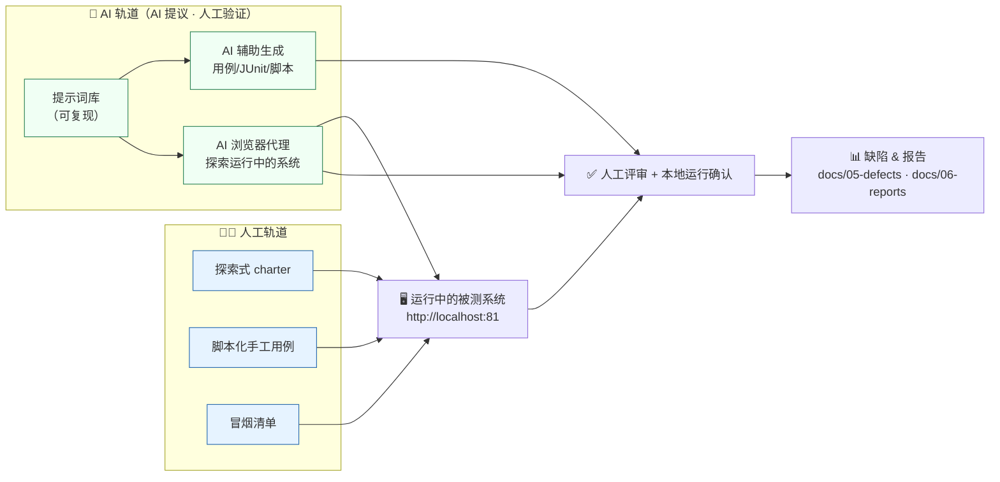
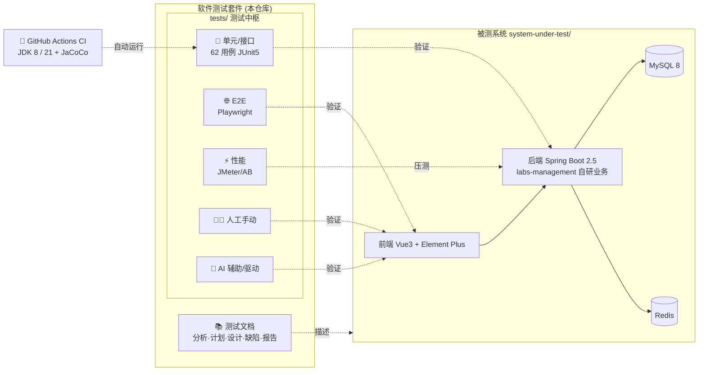

# 开放实验室预约系统 · 软件测试套件

> Open Lab Reservation System — Software Test Suite
> **一份覆盖「人工手动测试 + AI 辅助自动化测试」的软件测试全生命周期工程交付物**

[](https://github.com/LeiQingliang/open-lab-reservation-system-test-suite/actions/workflows/ci.yml)

-74%25-green.svg)


本仓库是 **「开放实验室网上预约管理系统」** 的完整软件测试工程交付物，涵盖从需求分析、测试计划、用例设计、单元/接口/性能/端到端测试实现，到缺陷跟踪与测试报告的**软件测试全生命周期**；并刻意并行呈现**两条测试轨道**——**人工手动测试**与 **AI 辅助/驱动的自动化测试**。仓库内附被测系统源码，**下载到本地即可一键起服务、照着重新手测与跑自动化测试**。核心自动化测试在 **GitHub Actions（JDK 8 / 21）上持续运行**。

---

## 📋 目录

- [✨ 项目简介](#-项目简介)
- [🧪 测试体系：人工 + AI 双轨](#-测试体系人工--ai-双轨)
- [🔺 测试金字塔与 `tests/` 中枢](#-测试金字塔与-tests-中枢)
- [🚀 在本地重新测一遍](#-在本地重新测一遍)
- [🧱 架构总览](#-架构总览)
- [📁 目录结构](#-目录结构)
- [🧭 文档导航（测试全生命周期）](#-文档导航测试全生命周期)
- [🔬 被测系统](#-被测系统)
- [🤝 参与贡献](#-参与贡献)
- [📜 许可证](#-许可证)

---

## ✨ 项目简介

这是一个 **软件测试套件**（而非一款产品）：以「开放实验室网上预约管理系统」为被测对象，系统性地完成并交付一整套测试工程产物。

亮点：

- 🧑‍💻 **完整的人工测试战役**：基于会话的探索式测试 + 脚本化手工用例，覆盖功能/输入校验/业务规则/界面/数据库/接口/白盒/安全等维度。真实执行结论（计划 63 例、执行 58 例、**通过率 79.3%**、记录 **12 个缺陷**）见 [`docs/06-reports/`](docs/06-reports/)；下载后可照着 [`tests/manual/`](tests/manual/) **重新手测**。
- 🤖 **AI 辅助 / AI 驱动测试**：把「AI 在测试中的真实用法」沉淀为方法论、可复用[提示词库](tests/ai/prompts/)与[探索式 playbook](tests/ai/ai-exploratory-playbook.md)——**AI 提议、人工验证**。详见 [`tests/ai/`](tests/ai/)。
- 🧪 **62 个可自动运行的测试**：JUnit 5 + Mockito + MockMvc（standaloneSetup），覆盖实验室 CRUD、排期笛卡尔积发布、预约冲突检测、审核流转等核心业务；纯单元/接口测试，**无需数据库/Redis** 即可离线运行。
- 🌐 **端到端 / 接口冒烟**：[`tests/e2e/`](tests/e2e/) 提供对准运行中系统的 **Playwright** 脚手架（接口冒烟稳健可跑、UI 用例为可调模板）。
- ⚡ **性能 / 并发**：[`tests/performance/`](tests/performance/) 内附可直接运行的 **JMeter / Apache Bench / curl / SQL** 脚本（从设计文档抽取，无编造数字）。
- 🔄 **真正的持续集成**：每次提交在 **JDK 8 与 21** 双矩阵自动构建并运行全部测试，产出 **JaCoCo 覆盖率**（labs-management 自研业务模块：行 74%、分支 85%）。
- 🚀 **一键复现环境**：内附被测系统源码（RuoYi 前后端分离），一条命令用 Docker 拉起 MySQL + Redis + 前后端。

---

## 🧪 测试体系：人工 + AI 双轨

本套件刻意并行呈现**两种互补的测试方式**，这是本项目最核心的特色——既体现「人作为测试者」的探索与判断，也体现「用 AI 做自动化测试」的工程化方法。

| 轨道 | 是什么 | 谁执行 | 入口 |
|------|--------|--------|------|
| 🧑‍💻 **人工手动测试** | 探索式测试（会话/charter）+ 脚本化手工用例，覆盖真实端到端交互（验证码、表单、跨模块流程、自动化难触达的发现） | **人**（你下载后照着跑） | [`tests/manual/`](tests/manual/) |
| 🤖 **AI 自动化测试** | ① AI 辅助生成测试资产（用例 / JUnit / 性能脚本）→ 人工评审运行；② AI 驱动浏览器代理探索运行中的系统 → 人工核实定缺陷 | **AI 提议 + 人工验证** | [`tests/ai/`](tests/ai/) · [`tests/e2e/`](tests/e2e/) |



> **诚信红线**：AI 是助手，其产物一律先经人工评审、再本地运行确认；所有真实执行数据只记录在 [`docs/06-reports/`](docs/06-reports/)。本仓库不交付任何「AI 自主跑出某结果」的假象。

---

## 🔺 测试金字塔与 `tests/` 中枢

所有可执行测试资产统一收敛到顶层 **[`tests/`](tests/)** 中枢，按测试金字塔分层组织：

| 层 | 目录 | 技术 | 纳入 CI | 本地运行 |
|----|------|------|:------:|----------|
| 单元 / 接口 | [`tests/unit/`](tests/unit/) → 模块内测试 | JUnit5 + Mockito + MockMvc（62 个 `@Test`） | ✅ | `cd system-under-test/back/labs && ./mvnw -pl labs-management -am clean test` |
| 性能 / 并发 | [`tests/performance/`](tests/performance/) | JMeter / AB / curl / SQL | — | `bash tests/performance/scripts/ab_benchmark.sh` |
| 端到端 | [`tests/e2e/`](tests/e2e/) | Playwright（JS） | — | `cd tests/e2e && npm install && npm test` |
| AI 辅助/驱动 | [`tests/ai/`](tests/ai/) | 方法论 + 提示词库 + playbook | — | 见 [playbook](tests/ai/ai-exploratory-playbook.md) |
| 人工手动 | [`tests/manual/`](tests/manual/) | 探索式 charter + 脚本化用例 + 冒烟清单 | — | 见 [冒烟清单](tests/manual/smoke-checklist.md) |

> 完整说明见 **[`tests/README.md`](tests/README.md)**。

---

## 🚀 在本地重新测一遍

> 目标：把仓库克隆到本地后，**人工**与**自动化**两条轨道都能照着跑通。

```bash
# 0) 起被测系统（仅需 Docker Desktop；一键拉起 MySQL+Redis+后端+前端）
./start.sh                       # Windows: start.ps1 / start.bat
#   前端 http://localhost:81   后端 http://localhost:8080   账号 admin/admin123

# 1) 自动化单元/接口测试（无需数据库；需 JDK 8 或 21，不支持 25+）
cd system-under-test/back/labs && ./mvnw -B -pl labs-management -am clean test

# 2) 人工冒烟 + 脚本化手测（照着清单点，把结果填进执行日志模板）
#    → tests/manual/smoke-checklist.md  +  tests/manual/manual-test-cases.md

# 3) E2E / 接口冒烟（Playwright）
cd tests/e2e && npm install && npm run install:browsers && npm test

# 4) 性能 / 并发脚本（按需）
bash tests/performance/scripts/ab_benchmark.sh

# 5) AI 驱动探索式测试（用 AI 浏览器代理遍历运行中的系统）
#    → 按 tests/ai/ai-exploratory-playbook.md 操作
```

各轨道的详细前置与玩法见对应目录 README：[manual](tests/manual/README.md) · [ai](tests/ai/README.md) · [e2e](tests/e2e/README.md) · [performance](tests/performance/README.md) · [unit](tests/unit/README.md)。

---

## 🧱 架构总览



---

## 📁 目录结构

```text
open-lab-reservation-system-test-suite/
├── .github/                     协作与自动化配置
│   ├── workflows/ci.yml         CI：JDK 8/21 运行测试 + JaCoCo 覆盖率
│   ├── ISSUE_TEMPLATE/          Issue 模板（Bug / 功能建议）
│   ├── PULL_REQUEST_TEMPLATE.md PR 模板
│   ├── ABOUT.md                 GitHub About 推荐配置
│   ├── CODEOWNERS               代码负责人
│   └── dependabot.yml           依赖更新
├── tests/                       ⭐ 测试中枢（统一入口）
│   ├── unit/                    单元/接口自动化测试入口（代码在 SUT 模块内，已纳入 CI）
│   ├── manual/                  🧑‍💻 人工手动测试：冒烟清单 / 脚本化用例 / 探索式 charter / 执行日志模板
│   ├── ai/                      🤖 AI 辅助&驱动测试：方法论 / 提示词库 / 探索 playbook
│   ├── e2e/                     🌐 Playwright 端到端 + 接口冒烟脚手架
│   └── performance/             ⚡ 性能/并发：JMeter 计划 / AB·curl 脚本 / 数据库性能 SQL
├── docs/                        测试工程文档（按软件测试生命周期组织）
│   ├── 01-analysis/             系统与需求分析
│   ├── 02-test-plan/            测试需求与测试计划
│   ├── 03-test-design/          测试设计（用例 / 白盒路径）
│   ├── 04-test-implementation/  测试实现（单元测试代码 / 性能脚本）
│   ├── 05-defects/              缺陷分析与缺陷清单
│   ├── 06-reports/              测试结果汇总
│   ├── diagrams/ guides/ reference/ deliverables/   图表 / 指南 / 参考 / 正式交付物
├── system-under-test/           被测系统源码（RuoYi 前后端分离）
│   ├── back/labs/               Spring Boot 后端（Maven 多模块，内置 mvnw）
│   │   └── labs-management/src/test/   ⭐ 自动化测试代码（本套件核心）
│   ├── front/RuoYi-Vue3/        Vue 3 前端
│   ├── docker/                  后端 / 前端 Docker 构建上下文
│   ├── docker-compose.yml       一键启动编排
│   └── .env.example             环境变量模板（复制为 .env）
├── start.* / stop.*             一键启动 / 停止脚本（Win / *nix）
├── CONTRIBUTING.md  SECURITY.md  CHANGELOG.md  CITATION.cff  LICENSE
└── README.md
```

---

## 🧭 文档导航（测试全生命周期）

测试**过程文档**按生命周期阶段组织，`docs/` 下子目录前缀编号即推荐阅读顺序；与 `tests/` 下的**可执行资产**一一呼应。

| 阶段 | 文档 | 说明 |
|------|------|------|
| ① 分析 | [01_系统上下文分析.md](docs/01-analysis/01_系统上下文分析.md) · [02_功能模块与数据库分析.md](docs/01-analysis/02_功能模块与数据库分析.md) | 系统上下文、功能模块与数据库 |
| ② 计划 | [03_测试需求与测试计划.md](docs/02-test-plan/03_测试需求与测试计划.md) | 测试需求梳理与总体计划 |
| ③ 设计 | [04_测试用例设计.md](docs/03-test-design/04_测试用例设计.md) · [测试用例总表.md](docs/03-test-design/测试用例总表.md) · [06_白盒路径分析.md](docs/03-test-design/06_白盒路径分析.md) | 用例设计、用例总表、白盒路径 |
| ④ 实现 | [05_单元测试代码.md](docs/04-test-implementation/05_单元测试代码.md) · [08_性能测试脚本.md](docs/04-test-implementation/08_性能测试脚本.md) | 单元测试、性能脚本（→ [`tests/`](tests/)） |
| ⑤ 缺陷 | [07_缺陷分析与修复.md](docs/05-defects/07_缺陷分析与修复.md) · [T29_缺陷清单.md](docs/05-defects/T29_缺陷清单.md) | 12 个缺陷分析与清单 |
| ⑥ 报告 | [09_测试结果汇总.md](docs/06-reports/09_测试结果汇总.md) | 通过率 79.3% · 缺陷密度 · 覆盖率 |
| 指南 | [如何启动项目.md](docs/guides/如何启动项目.md) | 被测系统完整启动与开发指南 |

文档目录索引见 [`docs/README.md`](docs/README.md)。

### 📦 正式交付物（`docs/deliverables/`）

测试计划 / 测试设计 / 测试报告 / 测试跟踪日志 / 课程设计说明书（`.docx`）+ [答辩大纲](docs/deliverables/T29_答辩大纲.md)。

---

## 🔬 被测系统

被测系统是基于 **若依(RuoYi)v3.8.9** 前后端分离框架二次开发的「开放实验室网上预约管理系统」，源码完整存放于 [`system-under-test/`](system-under-test/)，便于复现测试环境。自写业务集中在后端 `labs-management` 模块（实验室浏览、排课发布、预约）及对应前端视图。

### 🚀 一键启动（推荐）

只需安装 **Docker Desktop**，在仓库根目录运行 `start.bat` / `./start.ps1`（Windows）或 `./start.sh`（Linux/macOS），即可自动构建并拉起 MySQL + Redis + 后端 + 前端四个容器，无需本机安装 JDK/Maven/Node/MySQL/Redis。

启动后访问 **http://localhost:81** ，使用 `admin / admin123` 登录。停止用 `stop.bat` / `./stop.sh`。

> 🔐 **安全提示**：`admin/admin123`、数据库 `root` 等均为本地演示默认口令，**切勿用于公网或生产环境**。可通过复制 `system-under-test/.env.example` 为 `.env` 覆盖端口与口令。

#### 端口对照（默认值，可经 `.env` 覆盖）

| 服务 | 宿主机端口 | `.env` 变量 |
|------|-----------|-------------|
| 前端 | 81 | `FRONTEND_HOST_PORT` |
| 后端 | 8080 | `BACKEND_HOST_PORT` |
| MySQL | 3307 | `MYSQL_HOST_PORT` |
| Redis | 6380 | `REDIS_HOST_PORT` |

完整环境搭建与启动步骤（含 Docker 一键启动与传统手动方式）见 **[如何启动项目.md](docs/guides/如何启动项目.md)**。

### 技术栈

| 层级 | 技术 | 版本 |
|------|------|------|
| 后端 | Spring Boot + MyBatis + Maven | 2.5.15 |
| 前端 | Vue 3 + Element Plus + Vite | 3.4 / 2.4 / 5.0 |
| 数据库 | MySQL | 8.0（兼容 5.7） |
| 缓存 | Redis | 6.x+ |
| 安全 | Spring Security + JWT | 5.7 / jjwt 0.9 |
| 连接池 | Druid | 1.2.23 |
| JDK | Temurin / OpenJDK | **8**（编译目标，Docker 镜像内置）；测试在 8 与 21 均验证 · **不支持 JDK 25+** |
| 测试 | JUnit 5 · Mockito · MockMvc · JaCoCo · Playwright · JMeter | — |

> 数据库初始化脚本位于 `system-under-test/back/labs/sql/`。

---

## 🤝 参与贡献

欢迎补充测试用例、完善文档或改进工程化。请先阅读：

- [贡献指南 CONTRIBUTING.md](CONTRIBUTING.md) — 开发环境、运行测试、提交与 PR 规范
- [行为准则 CODE_OF_CONDUCT.md](CODE_OF_CONDUCT.md)
- [安全策略 SECURITY.md](SECURITY.md) ·  [获取帮助 SUPPORT.md](SUPPORT.md) ·  [更新日志 CHANGELOG.md](CHANGELOG.md)

---

## 📜 许可证

本项目采用 [MIT](LICENSE) 许可证，版权所有 © 2026 QINGLIANG LEI（雷清亮）。

被测系统基于 [RuoYi](https://gitee.com/y_project/RuoYi-Vue) 二次开发，其框架部分版权归原作者所有。
