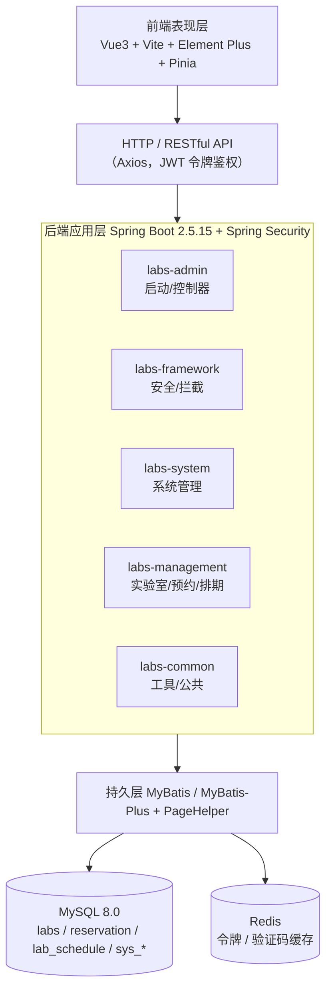
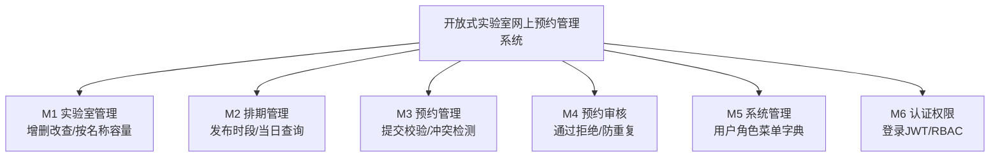
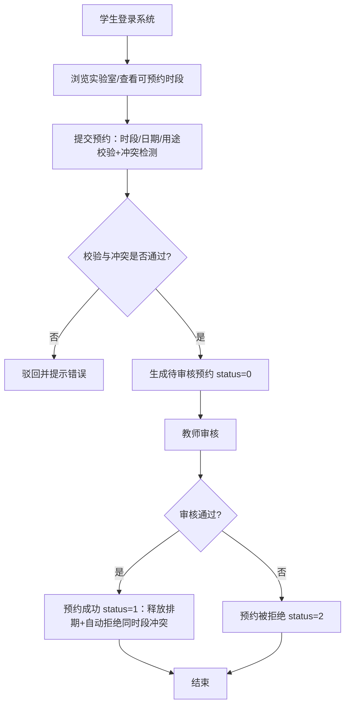
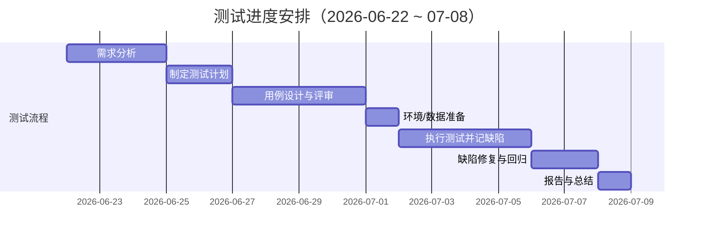
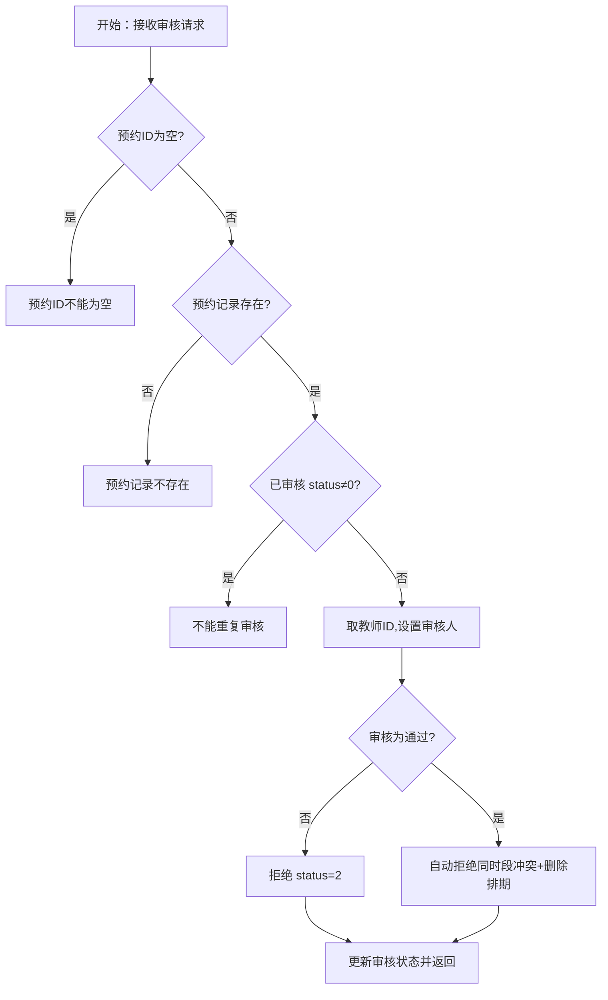
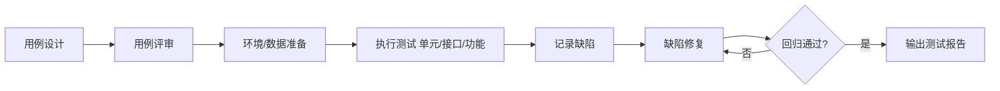

# 说明书配图源码（mermaid）

> 说明书中 4 张图已直接生成 PNG 并插入文档。本文件附上两张结构类图的 mermaid 源码，便于你后续在
> [mermaid.live](https://mermaid.live) 或支持 mermaid 的编辑器中修改重绘；图6-1、图7-1 为数据统计图（柱状/饼图），由 matplotlib 生成。

## 图1-1 系统技术架构图



## 图3-1 系统功能结构图



## 图6-1 缺陷分布 / 图7-1 通过率（数据图，已直接生成）

- 图6-1：左为「缺陷按模块分布」柱状图（预约管理5/预约审核2/排期管理2/实验室1/前端UI1/系统安全1），右为「按严重程度」饼图（严重4/一般6/轻微2）。
- 图7-1：各测试类型通过率柱状图（功能75% / 输入66.7% / 业务62.5% / 界面80% / 数据库100% / 接口90% / 单元100% / 安全66.7% / 性能100%），总体通过率 81.3%。

---

# 新增配图源码（说明书 图2-1 / 3-2 / 4-1 / 4-2 / 5-1）

> 以下图已直接生成 PNG 并插入说明书；此处附 mermaid 源码便于修改重绘。

## 图2-1 核心业务流程图


## 图3-2 测试进度安排甘特图


## 图4-1 insertReservation() 控制流图
```mermaid
flowchart TB
    S[开始：接收预约请求] --> D1{timeSlot∈[1,4]?}
    D1 -- 否 --> E1[时间段无效]
    D1 -- 是 --> D2{预约日期≥今天?}
    D2 -- 否 --> E2[不能预约过去日期]
    D2 -- 是 --> D3{labId 非空?}
    D3 -- 否 --> E3[实验室ID不能为空]
    D3 -- 是 --> D4{purpose 非空?}
    D4 -- 否 --> E4[预约用途不能为空]
    D4 -- 是 --> D5{存在时段冲突?}
    D5 -- 是 --> E5[该时段已被预约]
    D5 -- 否 --> OK[设置status=0,插入预约] --> R[返回成功]
```

## 图4-2 reviewReservation() 处理流程图


## 图5-1 测试执行流程图

