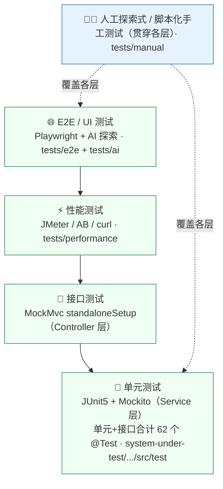

# 🧪 测试中枢（tests/）

> 本目录是整个软件测试套件的**统一入口**。它把分散在各处的测试资产组织成一条清晰的脉络：
> 从**人工手动测试**到**AI 辅助/驱动的自动化测试**，从单元层一直到端到端层，下载到本地后**都能照着重新跑一遍**。

被测系统（SUT）源码位于 [`../system-under-test/`](../system-under-test/)；本目录只放**测试**相关资产。

---

## 🔭 两条测试轨道

本套件刻意并行呈现**两种互补的测试方式**，这也是本项目的核心特色：

| 轨道 | 是什么 | 谁来执行 | 在哪 |
|------|--------|----------|------|
| 🧑‍💻 **人工手动测试** | 基于会话的探索式测试 + 脚本化手工用例，覆盖真实端到端交互（含验证码、表单、跨模块流程） | **人**（你下载后照着跑） | [`manual/`](manual/) |
| 🤖 **AI 自动化测试** | ①AI 辅助生成测试资产（用例/JUnit/脚本）→人工评审运行；②AI 驱动浏览器代理探索运行中的系统 | **AI 提议 + 人工验证** | [`ai/`](ai/) · [`e2e/`](e2e/) |

> **诚信原则贯穿全套件**：AI 是助手，其产物一律先经人工评审、再本地运行确认；
> 所有真实执行数据只记录在 [`../docs/06-reports/`](../docs/06-reports/)，本目录的脚本/用例是「可复测的资产」而非「已跑出的结论」。

---

## 🔺 测试金字塔（五层 × 本仓库落点）



| 层 | 目录 | 类型 | 是否纳入 CI | 本地运行入口 |
|----|------|------|:----------:|--------------|
| 单元 / 接口 | [`unit/`](unit/)（指向模块内测试） | JUnit5 + Mockito + MockMvc，62 个 `@Test` | ✅ JDK 8/21 + JaCoCo | `cd system-under-test/back/labs && ./mvnw -pl labs-management -am clean test` |
| 性能 | [`performance/`](performance/) | JMeter / Apache Bench / curl / SQL | ❌（需起服务） | `bash performance/scripts/ab_benchmark.sh` |
| E2E / 接口冒烟 | [`e2e/`](e2e/) | Playwright（JS） | ❌（需起服务） | `cd e2e && npm install && npm test` |
| AI 辅助 / 驱动 | [`ai/`](ai/) | 方法论 + 提示词库 + 探索 playbook | ❌（人在环） | 按 [`ai/ai-exploratory-playbook.md`](ai/ai-exploratory-playbook.md) |
| 人工手动 | [`manual/`](manual/) | 探索式 charter + 脚本化用例 + 冒烟清单 | ❌（人执行） | 见 [`manual/smoke-checklist.md`](manual/smoke-checklist.md) |

---

## 🚀 下载到本地后，如何重新测一遍

```bash
# 0) 起被测系统（仅需 Docker Desktop；一键拉起 MySQL+Redis+后端+前端）
./start.sh                       # Windows: start.ps1 / start.bat
#   前端 http://localhost:81   后端 http://localhost:8080   账号 admin/admin123

# 1) 自动化单元/接口测试（无需数据库，离线可跑；需 JDK 8 或 21，不支持 25+）
cd system-under-test/back/labs && ./mvnw -B -pl labs-management -am clean test

# 2) 人工冒烟 + 脚本化手测（照着清单点）
#    打开 tests/manual/smoke-checklist.md 逐条执行，结果填入 execution-log 模板

# 3) E2E / 接口冒烟（Playwright）
cd tests/e2e && npm install && npm run install:browsers && npm test

# 4) 性能/并发脚本（按需）
bash tests/performance/scripts/ab_benchmark.sh

# 5) AI 驱动探索式测试
#    按 tests/ai/ai-exploratory-playbook.md，用 AI 浏览器代理遍历 http://localhost:81
```

详尽的环境搭建（含传统手动方式）见 [`../docs/guides/如何启动项目.md`](../docs/guides/如何启动项目.md)。

---

## 📂 目录速览

```
tests/
├── README.md          本文件 · 测试中枢
├── unit/              单元/接口自动化测试入口（代码在 SUT 模块内，已纳入 CI）
├── manual/            人工手动测试：冒烟清单 / 脚本化用例 / 探索式 charter / 执行日志模板
├── ai/                AI 辅助&驱动测试：方法论 / 提示词库 / 探索 playbook
├── e2e/               Playwright 端到端 + 接口冒烟脚手架（对准运行中的系统）
└── performance/       性能/并发：JMeter 计划 / AB·curl 脚本 / 数据库性能 SQL
```

---

## 🧭 测试过程全景（与 docs/ 的对应）

测试**过程文档**（分析→计划→设计→实现→缺陷→报告）在 [`../docs/`](../docs/)，与本目录的**可执行资产**一一呼应：

| 阶段 | 过程文档（docs/） | 可执行资产（tests/） |
|------|------------------|---------------------|
| 分析 / 计划 | `01-analysis/`、`02-test-plan/` | — |
| 用例设计 | `03-test-design/`（用例总表、白盒路径） | `manual/manual-test-cases.md`、`manual/charters/` |
| 测试实现 | `04-test-implementation/`（单元、性能） | `unit/`、`performance/`、`e2e/` |
| 缺陷 | `05-defects/`（BUG-001~012） | `manual/`（观察点）、`e2e/`（回归守护） |
| 报告 | `06-reports/`（通过率 79.3%、12 缺陷） | `manual/execution-log-template.md`（复测记录） |
| AI 方法 | （贯穿） | `ai/`（方法论 + 提示词库） |

---

*课题编号：T29 ｜ 作者：雷清亮（QINGLIANG LEI）｜ 指导教师：刘嘉 ｜ 软件测试综合训练课程设计*
