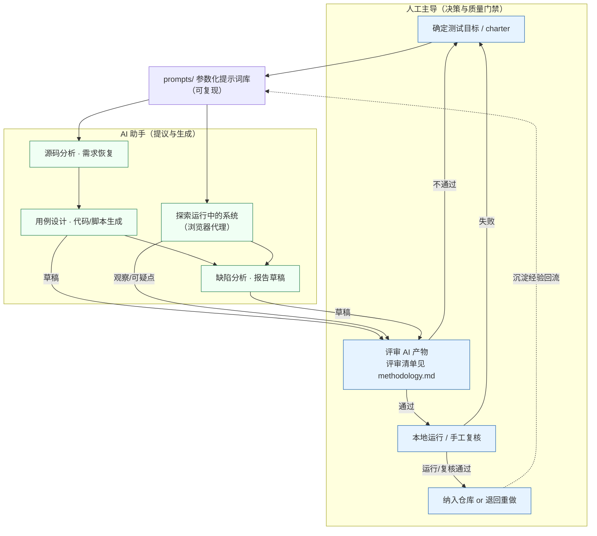

# AI 辅助 / AI 驱动测试轨道（tests/ai）

> 本目录沉淀本测试套件在制作与执行过程中**如何使用 AI 作为助手**的方法论、可复用提示词库与探索式 playbook。
>
> **一句话原则：AI 提议，人工验证。** 凡 AI 产出的用例、JUnit/接口代码、性能脚本与文档，一律先经人工评审、再本地运行确认，方可纳入仓库。本目录**不交付任何未经人工评审的 AI 产物**。

---

## ⚠️ 诚信声明（务必先读）

为避免对读者造成误导，明确以下边界：

- ✅ **AI 是助手**：用于加速源码阅读、需求恢复、用例草拟、样板代码生成、文档润色等。
- ✅ **产物经人工把关**：仓库内 [62 个 JUnit 测试](../unit/README.md)、`docs/` 各文档均由作者**人工评审并在本地运行/校对确认**后留存。
- ❌ **AI 未自主跑测、未自主"发现 N 个缺陷"**：`docs/06-reports/` 中的真实执行数据（计划 63 例、执行 58 例、通过率 79.3%、12 个缺陷）来自**人工设计与手工执行**，不是 AI 自动产出。
- ✅ **本目录的脚本/提示词是"可供本地复测/复用的模板"**，不是"已经跑出某结果"的证据。任何数字以 `docs/06-reports/` 为准。

---

## 🧭 两条子轨道

本轨道区分两类截然不同的"AI + 测试"用法，请勿混淆：

### 轨道 A —— AI 辅助测试资产生成（offline，已落地）

用 LLM 协助从**源码**出发，生成测试用例、JUnit/Mockito 单元测试、MockMvc 接口测试、性能脚本与文档草稿，再由人工评审、编译、运行确认后入库。

- 方法论：[methodology.md](methodology.md)
- 提示词库：[prompts/](prompts/)（01 系统分析 → 08 报告汇总）
- 落地产物：[tests/unit/](../unit/README.md)、[docs/](../../docs/)

### 轨道 B —— AI 驱动的探索式 / 端到端测试（online，可本地复现）

用具备**浏览器能力**的 AI 智能体（如 Claude in Chrome、Playwright MCP 等）对**运行中的系统**（`http://localhost:81`）做探索式遍历，由 AI 提出观察/可疑点，人工核实后归类为缺陷或确认为预期行为。

- 操作手册：[ai-exploratory-playbook.md](ai-exploratory-playbook.md)（真正由浏览器 AI 代理**驱动**的探索）
- AI 辅助生成的 E2E 脚手架：[tests/e2e/](../e2e/) — 注：这些 Playwright 用例由 AI **辅助生成**，运行时**不依赖 AI**；属"AI 辅助"产物，列于此处便于与 playbook 对照

> 两条轨道的共同纪律：**提示词入库以保证可复现**，**结论以人工复核为准**。

---

## 🔁 "AI 在环" 测试工作流



要点：**门禁在人工侧（H2/H3）**。AI 的任何输出在通过评审与运行确认之前，都只是"草稿/线索"。

---

## 📂 目录结构

```
tests/ai/
├── README.md                     本文件 · AI 测试总览
├── methodology.md                AI 辅助测试方法论（流水线 + 人工评审清单）
├── ai-exploratory-playbook.md    AI 驱动探索式/E2E 会话 playbook
└── prompts/                      可复用、参数化提示词库（简体中文）
    ├── 01_系统分析与需求恢复.md
    ├── 02_测试用例设计.md
    ├── 03_单元测试代码生成.md      JUnit5 + Mockito，不依赖 DB
    ├── 04_接口测试生成.md          MockMvc standaloneSetup
    ├── 05_性能测试脚本生成.md
    ├── 06_缺陷分析与根因.md
    ├── 07_AI探索式测试charter.md   驱动浏览器/LLM 代理遍历运行中的系统
    └── 08_测试报告汇总.md
```

---

## ▶️ 如何使用本目录

1. **想复现"AI 帮我生成测试资产"**：读 [methodology.md](methodology.md) 了解流水线与门禁，按阶段从 [prompts/](prompts/) 取对应提示词，填好占位符后投喂给你的 LLM，再用评审清单逐项把关。
2. **想做一次"AI 探索运行中的系统"**：先用 `start.*` 启动被测系统，再按 [ai-exploratory-playbook.md](ai-exploratory-playbook.md) 一步步操作，用 [07_AI探索式测试charter.md](prompts/07_AI探索式测试charter.md) 作为 charter。
3. **任何产物**：先评审、再运行、后入库。不要直接提交未经确认的 AI 输出。

---

## 🔗 相关链接

- 自动化单元/接口测试（落地产物）：[tests/unit/](../unit/README.md)
- 可运行的 AI 辅助 E2E：[tests/e2e/](../e2e/)
- 单元测试设计说明：[docs/04-test-implementation/05_单元测试代码.md](../../docs/04-test-implementation/05_单元测试代码.md)
- 真实测试结果汇总（人工执行）：[docs/06-reports/09_测试结果汇总.md](../../docs/06-reports/09_测试结果汇总.md)
- 缺陷清单（人工记录）：[docs/05-defects/T29_缺陷清单.md](../../docs/05-defects/T29_缺陷清单.md)

---

*作者：雷清亮（QINGLIANG LEI）｜指导教师：刘嘉｜课题编号 T29｜软件测试综合训练课程设计*
