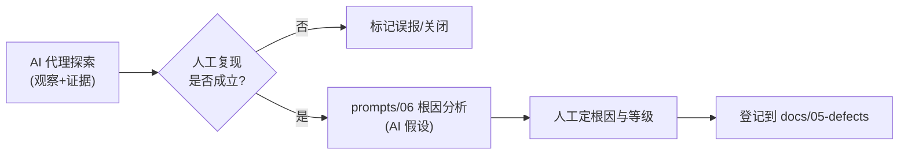

# AI 驱动探索式 / E2E 测试 Playbook

> 本文给出**轨道 B** 的分步操作手册：用具备浏览器能力的 AI 智能体（如 **Claude in Chrome**、**Playwright MCP** 浏览器代理）对**运行中的系统**做一次 AI 驱动的探索式 / 端到端会话。
>
> **纪律不变：AI 探索并如实记录观察，人工核实并裁定缺陷。** 本会话产出的是"可疑点线索"，不是结论；任何缺陷需经人工复核后才成立。

---

## 0. 适用与产出

| 项 | 说明 |
|----|------|
| 适用场景 | 在自动化单元/接口测试之外，补充对真实 UI + 端到端流程的探索 |
| 智能体 | Claude in Chrome / Playwright MCP / 其他浏览器代理 |
| 产出 | 观察记录表（步骤/输入/预期/实际/证据/可疑度）+ 建议人工确认的 Top N 可疑点 |
| 不产出 | 缺陷总数定论、性能数字、"AI 自主发现 N 个缺陷"之类表述 |

---

## 1. 环境准备

### 1.1 启动被测系统

在仓库根目录用一键脚本拉起（基于 Docker Compose：MySQL + Redis + 后端 + 前端）：

```bash
# Linux / macOS / Git Bash
./start.sh
# Windows PowerShell
./start.ps1
# Windows cmd
start.bat
```

访问与账号：

| 项 | 值 |
|----|----|
| 前端 | http://localhost:81 |
| 后端 API | http://localhost:8080 |
| 登录账号 | `admin` / `admin123` |
| 宿主机端口（默认，可经 `system-under-test/.env` 覆盖） | 前端 81、后端 8080、MySQL 3307、Redis 6380 |

> ⚠️ **图形验证码**：RuoYi 登录带图形验证码（`/captchaImage` + uuid）。浏览器 AI 代理通常无法稳定自动识别验证码，**登录这一步建议人工完成**，登录成功后再把控制权交给代理继续探索。

### 1.2 准备 AI 浏览器代理

- **Claude in Chrome**：在浏览器中授予对应站点（localhost）的操作权限；确认代理能读取页面、点击、填表、截图、读控制台/网络。
- **Playwright MCP**：确保 MCP 浏览器服务已连接，能 navigate / click / fill / screenshot。

### 1.3 探索前的安全约定（务必先与代理对齐）

- 仅在测试数据上操作；**删除/批量修改等破坏性动作前必须暂停并征求人工同意**。
- 如实记录：只记录"实际执行过且亲眼所见"的步骤与结果，不得脑补。
- 遇验证码/登录墙暂停，提示人工接管。

---

## 2. 给代理下发 charter（探索章程）

把 [prompts/07_AI探索式测试charter.md](prompts/07_AI探索式测试charter.md) 的提示词正文填好占位符后投喂给代理。建议首轮 charter：

> **charter：聚焦"预约提交流程的输入校验与冲突检测"，时间盒 30 分钟。**
> 重点风险：重复预约（同实验室同时段）、非法 timeSlot（99/0）、过去日期、空用途、未登录/越权访问。

可按需追加更多 charter（每个 charter 聚焦一个目标），例如：
- charter-2：实验室浏览与详情（含 `@Anonymous` 列表）的展示一致性。
- charter-3：预约审核流转（待审核 → 通过/拒绝）的状态与界面反馈。

---

## 3. 探索执行步骤（以预约流程为例）

> 下面是给人工监督者的执行节奏；具体页面操作由代理完成、人工旁观。

1. **登录（人工）**：打开 http://localhost:81，输入 `admin/admin123` 与验证码，登录成功。
2. **走通正常路径（代理）**：浏览实验室列表 → 进入某实验室 → 发起预约 → 选择日期/时间段、填写用途 → 提交 → 查看预约列表与状态。逐步记录界面与响应。
3. **针对性扰动（代理）**，逐条尝试并记录：
   - **重复预约**：对同一实验室、同一日期、同一时间段，连续提交两次预约，观察第二次是否被拒绝。
   - **非法时间段**：尝试让 `timeSlot` 取 0 / 99（如界面不允许，则记录界面是否限制；如可绕过则记录后端反应）。
   - **过去日期**：选择已过去的日期（如去年）提交，观察是否被拒。
   - **空用途**：用途留空提交，观察是否被拒。
   - **越权/未登录访问**：退出登录或直接访问受保护页面/接口，记录返回与错误提示（如是否出现 500 而非 401 的不友好错误）。
4. **抓证据（代理）**：每个观察点截图；必要时读取浏览器控制台报错与网络请求/响应（状态码、响应体）。

> 这些扰动方向与历史人工测试结论相呼应（见 `docs/06-reports/`：典型现象包括"无冲突检测"、"timeSlot/日期缺校验"、"未授权返回 500 而非 401"）。**代理的任务是独立观察并如实复现现象，而不是照抄已知结论。**

---

## 4. 如何记录发现

让代理按统一表格输出（charter 提示词已要求）：

| 序号 | charter | 操作步骤 | 输入 | 预期 | 实际 | 证据 | 可疑度(高/中/低) | 备注 |
|------|---------|----------|------|------|------|------|------------------|------|
| 1 | 冲突检测 | 同实验室同时段提交两次 | lab=1,date=明天,slot=1 | 第二次应被拒 | （代理填写真实所见） | 截图/网络响应 | （代理初判） | 待人工确认 |

记录原则：
- **预期**基于业务常识/规则恢复（见 [prompts/01](prompts/01_系统分析与需求恢复.md)）；
- **实际**只写亲眼所见 + 证据；
- **可疑度**仅为代理初判，不等于缺陷定级。

会话产物建议保存到你自己的工作区（如截图目录），**不要写入或修改仓库已有文件**。

---

## 5. 如何把发现归类为缺陷

这是**人工环节**，AI 不越权：

1. **人工复核每条观察**：亲自复现代理记录的步骤，确认现象真实、可重复。
2. **过滤误报**：排除环境问题、操作误解、预期理解偏差。
3. **正式缺陷分析**：对确认成立的现象，使用 [prompts/06_缺陷分析与根因.md](prompts/06_缺陷分析与根因.md) 做根因假设与修复建议（AI 给假设，人工定根因与等级）。
4. **归档**：将确认的缺陷按 `docs/05-defects/T29_缺陷清单.md` 的格式登记（编号、标题、模块、等级、复现步骤、实际/预期、根因、修复建议）。
5. **诚信复核**：确保对外表述为"人工经 AI 辅助探索后复核确认的缺陷"，**不写**"AI 自主发现了 N 个缺陷"。



---

## 6. 收尾

- 停止被测系统：`./stop.sh` / `./stop.ps1` / `stop.bat`。
- 整理本次会话的观察表与截图（留在个人工作区）。
- 若产生确认缺陷或新用例，按既有文档格式补充到 `docs/`（人工提交），并考虑把好用的 charter 经验回流到 [prompts/07](prompts/07_AI探索式测试charter.md)。

---

## 7. 诚信红线复述

- AI 是探索助手；**所有缺陷以人工复核为准**。
- 不杜撰未执行的操作、不编造结果与性能数字。
- 不声称"AI 自主跑完某套件 / 自主发现具体缺陷数"。
- 本 playbook 产出的提示词与步骤是**用户可本地复用的模板**。

---

*作者：雷清亮（QINGLIANG LEI）｜指导教师：刘嘉｜课题编号 T29*
