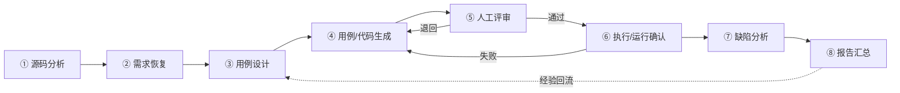

# AI 辅助测试方法论

> 本文件详述**轨道 A：AI 辅助测试资产生成**的完整流水线、每一步的 AI/人工分工与质量门禁，并给出可逐项打勾的"AI 生成测试人工评审清单"。
>
> 适用对象：希望在本项目（或同类 RuoYi 二开系统）上用 LLM 加速测试工程、同时保证产物质量与诚信的人。

---

## 0. 核心立场

| 立场 | 含义 |
|------|------|
| **AI 提议，人工验证** | AI 产出一律视为"草稿/线索"，未经评审与运行确认不得入库。 |
| **可复现优先** | 每个阶段使用的提示词都收入 [prompts/](prompts/)，参数化、可重跑。 |
| **诚信至上** | 不把 AI 草稿伪装成"已执行结果"；真实执行数据只在 `docs/06-reports/`。 |
| **确定性测试** | 生成的自动化测试不得依赖数据库/Redis/网络/时钟随机性，保证 CI 稳定。 |

---

## 1. 流水线总览



> 关键：⑤⑥ 是**质量门禁**。任何阶段产物只有"通过评审 + 运行确认"才向下游流动。

---

## 2. 各阶段详解

下表中"质量门禁"是该阶段**必须满足才放行**的硬性条件。

### ① 源码分析
- **AI 角色**：快速通读 `system-under-test/back/labs/labs-management` 源码，归纳模块、Controller/Service/Mapper 职责、关键分支与依赖。
- **人工角色**：指定范围、校验 AI 归纳是否与源码一致、补充 AI 漏读的上下文。
- **输入**：被测源码、目录结构。
- **输出**：模块/接口清单、控制流要点（草稿）。
- **提示词**：[prompts/01_系统分析与需求恢复.md](prompts/01_系统分析与需求恢复.md)
- **质量门禁**：AI 给出的每条结论都能在源码中定位到具体类/方法/行；无凭空臆造的接口或字段。

### ② 需求恢复（源码即需求）
- **AI 角色**：在缺少原始需求文档时，从源码与 API 反推功能需求、业务规则（如冲突检测、时间段 1–4、日期合法性）。
- **人工角色**：确认"恢复出的规则"是真实意图还是实现缺陷（例如"无冲突检测"是缺陷而非需求）。
- **输入**：阶段①产物、真实 API 列表。
- **输出**：功能点与业务规则清单（草稿）。
- **提示词**：[prompts/01_系统分析与需求恢复.md](prompts/01_系统分析与需求恢复.md)
- **质量门禁**：区分"应有规则"与"现状实现"，不把缺陷写成需求。

### ③ 用例设计
- **AI 角色**：用等价类/边界值/场景法/判定表生成用例草案，含编号、前置、步骤、数据、预期。
- **人工角色**：裁剪冗余、补充遗漏边界、校正预期（尤其是与真实缺陷相关的预期）。
- **输入**：阶段②清单。
- **输出**：用例草表（对齐 `docs/03-test-design/测试用例总表.md` 格式）。
- **提示词**：[prompts/02_测试用例设计.md](prompts/02_测试用例设计.md)
- **质量门禁**：每条用例可追溯到功能点/规则；预期明确、可判定。

### ④ 用例/代码生成
- **AI 角色**：把用例转化为可编译的 JUnit5+Mockito 单元测试、MockMvc(standaloneSetup) 接口测试、性能脚本草稿。
- **人工角色**：审代码风格、断言意义、Mock 合理性。
- **输入**：阶段③用例、被测类签名。
- **输出**：测试代码/脚本草稿。
- **提示词**：[03_单元测试代码生成](prompts/03_单元测试代码生成.md)、[04_接口测试生成](prompts/04_接口测试生成.md)、[05_性能测试脚本生成](prompts/05_性能测试脚本生成.md)
- **质量门禁**：见下方[人工评审清单](#3-ai-生成测试人工评审清单)。

### ⑤ 人工评审（门禁）
- **AI 角色**：可辅助自评（"找出你这段测试里可能的假断言"）。
- **人工角色**：逐项执行评审清单，决定通过/退回。
- **输入**：阶段④草稿。
- **输出**：评审意见 + 通过/退回结论。
- **质量门禁**：评审清单全部项通过方可放行。

### ⑥ 执行 / 运行确认（门禁）
- **AI 角色**：辅助定位编译/运行报错原因。
- **人工角色**：本地运行命令，确认编译通过、测试稳定（多次运行结果一致）。
- **输入**：通过评审的代码。
- **运行命令**（务必在 `system-under-test/back/labs` 下，保留 `-am`）：
  ```bash
  # Git Bash / Linux / macOS
  ./mvnw -B -pl labs-management -am clean test
  # Windows PowerShell
  .\mvnw.cmd -B -pl labs-management -am clean test
  ```
- **输出**：可入库的测试 + 本地运行证据（surefire 报告 / JaCoCo）。
- **质量门禁**：编译通过、用例稳定通过、覆盖率不下降。

### ⑦ 缺陷分析
- **AI 角色**：对人工执行中发现的现象做根因假设、归类、给修复建议草稿。
- **人工角色**：核实根因、确认严重等级、定缺陷编号。
- **输入**：人工执行观察、相关源码。
- **输出**：缺陷条目草稿（对齐 `docs/05-defects/`）。
- **提示词**：[prompts/06_缺陷分析与根因.md](prompts/06_缺陷分析与根因.md)
- **质量门禁**：每个根因有源码佐证；不虚报缺陷数量。

### ⑧ 报告汇总
- **AI 角色**：把人工确认的执行数据整理成结构化报告草稿（图表文字版、统计表）。
- **人工角色**：核对每个数字与 `docs/06-reports/` 一致，签字定稿。
- **输入**：人工执行的真实数据。
- **输出**：报告草稿。
- **提示词**：[prompts/08_测试报告汇总.md](prompts/08_测试报告汇总.md)
- **质量门禁**：**报告中所有数字均为真实执行所得，禁止 AI 杜撰任何性能/通过率数据。**

---

## 3. AI 生成测试人工评审清单

> 用于阶段⑤。建议逐项打勾；任一项不过即退回阶段④重做。

### 3.1 正确性与诚信
- [ ] **无臆造断言**：断言的期望值来自真实业务逻辑/源码，不是为了"凑绿"而硬编码。
- [ ] **断言有意义**：不是 `assertTrue(true)`、`assertNotNull(obj)` 之类空断言；覆盖了真正的行为契约。
- [ ] **无虚假覆盖**：没有为提高覆盖率而调用方法却不断言结果。
- [ ] **不冒充已执行**：注释/命名中不出现"已通过/已发现缺陷"等暗示其为既成事实的措辞（结果以本地运行为准）。

### 3.2 可编译与可运行
- [ ] **可编译**：导入正确，类/方法签名与被测代码一致，能通过 `mvnw ... test` 编译。
- [ ] **确定性**：不依赖系统时钟、随机数、执行顺序、外部网络；可重复稳定通过。
- [ ] **不依赖 DB/Redis/Spring 上下文**：Service 测试用 Mockito 隔离 Mapper；Controller 测试用 MockMvc `standaloneSetup`，不加载完整容器。

### 3.3 设计与可维护
- [ ] **隔离正确**：Mock 的是数据访问层/外部依赖，而非把被测逻辑也 Mock 掉。
- [ ] **命名规范**：测试类 `XxxTest`，方法见名知意；`@DisplayName` 标注可追溯用例编号（如 `UT-RSV-S-01`）。
- [ ] **结构清晰**：遵循 Arrange–Act–Assert；`@BeforeEach` 准备公共夹具。
- [ ] **可追溯**：能对应到 `docs/03-test-design/测试用例总表.md` 中的用例。

### 3.4 范围与一致性
- [ ] **风格一致**：与现有 7 个测试类（见 [tests/unit](../unit/README.md)）的写法、包结构一致。
- [ ] **不改动既有文件**：新增测试不破坏/不重写仓库已有测试与源码。
- [ ] **边界齐全**：正常 + 异常 + 边界（如 timeSlot 边界、空值、查无记录返回 null）均有覆盖或明确说明取舍。

---

## 4. 已落地产物（真实，供追溯）

| 产物 | 位置 | 说明 |
|------|------|------|
| 62 个 JUnit5 测试（7 个测试类） | `system-under-test/back/labs/labs-management/src/test/java/com/labs/` | 纯 JUnit5+Mockito+MockMvc，CI 在 JDK 8/21 双矩阵运行 |
| 单元测试设计说明 | [docs/04-test-implementation/05_单元测试代码.md](../../docs/04-test-implementation/05_单元测试代码.md) | |
| 性能测试脚本说明 | [docs/04-test-implementation/08_性能测试脚本.md](../../docs/04-test-implementation/08_性能测试脚本.md) | |
| 真实测试结果汇总 | [docs/06-reports/09_测试结果汇总.md](../../docs/06-reports/09_测试结果汇总.md) | 计划 63 / 执行 58 / 通过率 79.3% / 12 缺陷（人工执行） |

> 以上覆盖率（labs-management 行 ~74%、分支 ~85%）与执行数据均为**人工评审并本地运行后**留存，AI 仅在生成草稿阶段提供协助。

---

*作者：雷清亮（QINGLIANG LEI）｜指导教师：刘嘉｜课题编号 T29*
